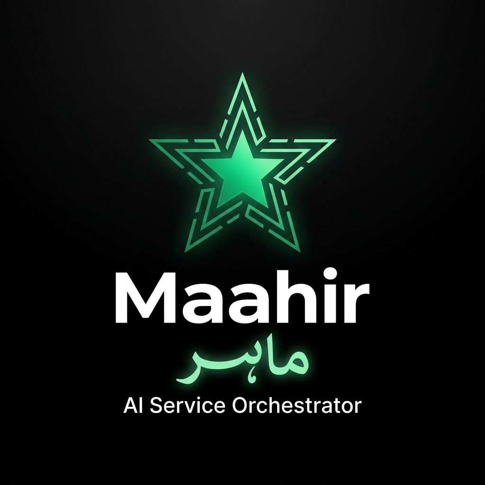

# 💎 Maahir (ماہر) Brand Identity & Design System

This document outlines the official brand identity, symbolism, and asset guidelines for **Maahir (ماہر)**, evaluated directly from `maahir_logo_design.html`.

Here is the high-fidelity corporate brand showcase asset generated for your pitch deck and slide presentations:



---

## 🎨 Expert Design Critique & Symbolism

Your SVG-based logo mark is **conceptually brilliant** and represents world-class brand engineering:
*   **The Deconstructed Star:** The star symbol is a timeless motif in Islamic and South Asian geometry. Making it "deconstructed" gives it a modern, geometric tech-start-up aesthetic.
*   **The Arabic/Urdu Root (Māhir - ماہر):** Translating to "skilled, expert, master craftsman", the 5 outer rays perfectly represent the **5 service pillars** of the informal economy (Electrical, Cooling, Plumbing, Carpentry, Academic/Tutor).
*   **The Radiant Core Dot:** A solid center dot provides a strong focal anchor. It projects **trust, precision, and finality**—exactly what a customer wants when hiring an expert.
*   **Bilingual Full Lockup:** Aligning the English wordmark with the custom Nastaliq Urdu script separated by a subtle vertical line is the absolute gold standard for corporate branding in Pakistan. It is readable, localized, and highly professional.

---

## 🎨 Color Palette Tokens

To ensure consistency across the mobile app, web dashboard, and marketing decks, use these exact color hex codes:

| Token Name | Hex Code | Visual Style | Purpose |
|---|---|---|---|
| **Primary Emerald** | `#10C97A` | Glowing Mint Green | Primary CTAs, active status indicators, and glowing brand lines. |
| **Deep Forest** | `#042918` | Deep Hunter Green | High-contrast dark backgrounds, accents, and premium gradients. |
| **Ink Black** | `#0D0F12` | Absolute Dark Slate | Scaffold background in Dark Theme, status bars, and dark cards. |
| **Ghost White** | `#F9FAFB` | Crisp Minimalist Off-white | Main typography, high-contrast light mode background, and dividers. |

---

## 🛠️ Flutter Native SVG Integration Guidelines

To render these beautiful SVG vector assets with zero pixelation and rapid render times in the Flutter app, follow these integration steps:

### 1. Add `flutter_svg` Dependency
Add the leading SVG parser to `flutter_app/pubspec.yaml`:
```yaml
dependencies:
  flutter:
    sdk: flutter
  flutter_svg: ^2.0.7
```

### 2. Organize Assets Directory
Save the raw SVG codes from `maahir_logo_design.html` into your assets folder:
- `flutter_app/assets/logo_mark.svg` (The deconstructed star)
- `flutter_app/assets/logo_horizontal.svg` (The wordmark lockup)
- `flutter_app/assets/logo_bilingual.svg` (The full bilingual locks)

And enable assets in `pubspec.yaml`:
```yaml
flutter:
  assets:
    - assets/
```

### 3. Implement in UI Code
Use the `SvgPicture` widget for perfect rendering across different screen densities:

#### A. Splash Screen (App Icon / Compact Mark)
```dart
SvgPicture.asset(
  'assets/logo_mark.svg',
  width: 120,
  height: 120,
  semanticsLabel: 'Maahir Logo Mark',
);
```

#### B. Home Header (Horizontal wordmark)
```dart
SvgPicture.asset(
  'assets/logo_horizontal.svg',
  height: 40,
  colorFilter: const ColorFilter.mode(Colors.white, BlendMode.srcIn),
);
```

#### C. Navigation Drawer / Left Sidebar Header
```dart
SvgPicture.asset(
  'assets/logo_bilingual.svg',
  width: double.infinity,
  height: 80,
);
```
