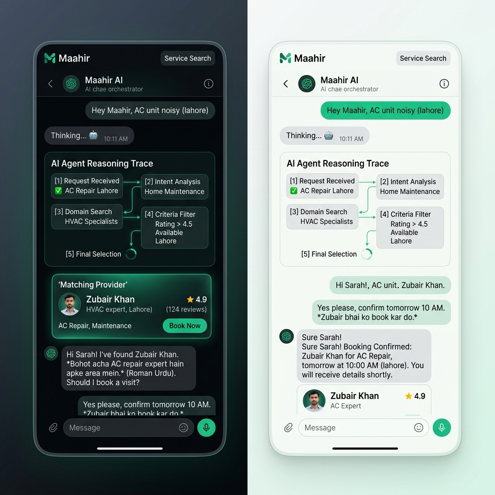

# 🎨 Maahir UI/UX Redesign & Theme Strategy Proposal

We evaluated your HTML layout in `maahir_redesign.html` and generated an ultra-premium dual-theme concept. To build a solution that truly wows judges and acts as a professional, commercial-grade product, we must take your design **even further**.

Here is our conceptual UI mockup showcasing how **Maahir** translates to a high-fidelity dual-theme mobile interface:



---

## 🧐 UI/UX Critique: `maahir_redesign.html`

Your HTML mockup is **exceptional**. It utilizes high-end visual patterns that immediately elevate it above basic designs:
- **Harsh Black/Deep Gray Palette (`#0D0F12`, `#161A20`):** Provides a rich, premium digital experience.
- **Urdu Font Integration (`Noto Nastaliq Urdu`):** Highly crucial for cultural localization.
- **Location Pill & Status Bars:** Makes it feel like a real native mobile application.
- **Glowing Logo & Emerald Accent (`#10C97A`):** Standard Google Developer aesthetic.

### Where we can go "Even Beyond":
While your dark mode is gorgeous, professional apps **always provide a clean, high-contrast Light Mode**. 

For a service provider app in Pakistan, a **Dual-Theme (Light/Dark Mode)** is not just a cosmetic feature—it is a **critical usability requirement**:
- **☀️ Light Mode for Outdoor Technicians:** Electricians, plumbers, and mechanics will often use this app outdoors in intense, direct Pakistani sunlight (often 40°C+). Dark mode is nearly invisible outdoors due to screen glare. A high-contrast, pure-white light mode guarantees readability.
- **🌙 Dark Mode for Indoor Customers:** Homeowners and students booking tutors or beauticians indoors at night prefer a soft, battery-saving dark interface.

---

## 💎 Proposed UI/UX Enhancements for Maahir

To achieve an elite status that secures top placement in the hackathon, we recommend implementing the following visual mechanics:

### 1. Glassmorphism & Depth
- Wrap your top navigation bars and bottom navigation in a **frosted-glass backdrop filter** with dynamic blur (`BackdropFilter` with `ImageFilter.blur`).
- Apply subtle 1px border gradients using transparent overlays so the boundaries glow slightly under dark themes.

### 2. State-of-the-Art Skeletal Loaders
- Instead of static text or a generic spinner during the multi-agent reasoning trace, display an animated **gradient skeleton pulse** inside the activity drawer. This gives the user a tactile, responsive sense of the agents actively calculating behind the scenes.

### 3. Emerald & Mint Color Tokens
Avoid generic greens. Use a cohesive, harmonious palette:
- **Primary Emerald:** `0xFF10C97A` (Energetic, professional green)
- **Mint Accent (Glows):** `0xFF0EE688` (For buttons and micro-interactions)
- **Pakistan Flag Green (Deep):** `0xFF0A3D2B` (Used as gradients for brand identity background elements)

---

## 🛠️ Step-by-Step Flutter Dual-Theme Implementation

Here is the exact architectural blueprint to implement both themes cleanly using Flutter's built-in `ThemeData` and `Provider` state management:

### 1. Define Theme Modes in `lib/theme/app_theme.dart`
```dart
import 'package:flutter/material.dart';
import 'package:google_fonts/google_fonts.dart';

class AppTheme {
  // --- 🌙 PREMIUM DARK THEME ---
  static ThemeData get darkTheme {
    return ThemeData(
      brightness: Brightness.dark,
      scaffoldBackgroundColor: const Color(0xFF0D0F12),
      primaryColor: const Color(0xFF10C97A),
      cardColor: const Color(0xFF161A20),
      dividerColor: const Color(0xFF1E2229),
      textTheme: TextTheme(
        bodyLarge: GoogleFonts.sora(color: const Color(0xFFF9FAFB)),
        bodyMedium: GoogleFonts.sora(color: const Color(0xFFD1D5DB)),
        labelSmall: GoogleFonts.notoNastaliqUrdu(color: const Color(0xFF10C97A)),
      ),
      appBarTheme: const AppBarTheme(
        backgroundColor: Color(0xFF0D0F12),
        elevation: 0,
      ),
    );
  }

  // --- ☀️ PREMIUM LIGHT THEME ---
  static ThemeData get lightTheme {
    return ThemeData(
      brightness: Brightness.light,
      scaffoldBackgroundColor: const Color(0xFFF9FAFB),
      primaryColor: const Color(0xFF10C97A),
      cardColor: Colors.white,
      dividerColor: const Color(0xFFE5E7EB),
      textTheme: TextTheme(
        bodyLarge: GoogleFonts.sora(color: const Color(0xFF111827)),
        bodyMedium: GoogleFonts.sora(color: const Color(0xFF4B5563)),
        labelSmall: GoogleFonts.notoNastaliqUrdu(color: const Color(0xFF0A3D2B)),
      ),
      appBarTheme: const AppBarTheme(
        backgroundColor: Color(0xFFF9FAFB),
        elevation: 0,
      ),
    );
  }
}
```

### 2. Connect Dynamic Switch inside the Sidebar Drawer
Create a theme state provider and add a toggle button inside the Left Session Sidebar Drawer:
```dart
// Inside Sidebar Navigation Drawer Widget:
ListTile(
  leading: Icon(
    themeProvider.isDarkMode ? Icons.wb_sunny_outlined : Icons.dark_mode_outlined,
    color: Theme.of(context).primaryColor,
  ),
  title: Text(themeProvider.isDarkMode ? 'Light Mode' : 'Dark Mode'),
  trailing: Switch(
    value: themeProvider.isDarkMode,
    activeColor: const Color(0xFF10C97A),
    onChanged: (value) {
      themeProvider.toggleTheme();
    },
  ),
);
```
