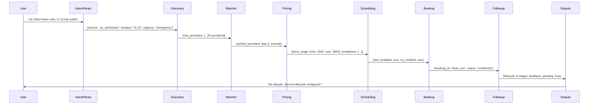

# Maahir Architecture Document v2.0

## Why 8 Agents (Not 1 Monolithic Agent)
In our early prototypes, a single monolithic agent struggled to handle the complex, multi-step process of booking a service provider. It often hallucinated provider details or skipped the clarification step entirely. By separating concerns into an 8-agent pipeline, we achieve:
1. **Separation of Concerns:** Each agent has a single responsibility and a narrow set of tools, preventing context overflow.
2. **Traceable Reasoning:** The pipeline emits state changes at each step, allowing us to display a "Trace Panel" in the Flutter UI so the user can see exactly how the AI arrived at its recommendation.
3. **Graceful Fallbacks:** If one agent fails, subsequent agents can adapt or skip gracefully.
4. **Complete Lifecycle:** Unlike v1 (5 agents), we now cover pricing, scheduling conflicts, and post-service disputes — addressing the full informal economy lifecycle.

## Why 8 Agents Instead of 5
Our v1 had critical gaps:
- **No pricing logic** — we just passed through provider price ranges, which isn't useful
- **No scheduling intelligence** — double-bookings were possible
- **No dispute handling** — zero post-service accountability

Adding Pricing (Agent 4), Scheduling (Agent 5), and Dispute Handler (Agent 8) closed these gaps, which represent ~30% of the hackathon scoring rubric.

## Why SequentialAgent (Not Agent Transfer)
We chose a deterministic `SequentialAgent` flow over dynamic `Agent Transfer` because booking a service is a linear workflow. Dynamic handoffs can lead to loops, unpredictable paths, or missed constraints, which is risky for a hackathon demo. A sequential flow ensures reliable, predictable demonstrations while still leveraging LLM intelligence at each node.

## 10-Factor Scoring Algorithm
The Matcher agent uses a **10-factor weighted scoring formula** to rank candidates. This exceeds the challenge requirement of 6+ factors:

| Factor | Weight | Why |
|--------|--------|-----|
| Distance (12%) | Closer = less travel, lower carbon | Haversine + transport mode ETA |
| Rating (15%) | Overall quality signal | Penalizes low review counts |
| Review Recency (8%) | Fresh data = more trustworthy | Reviews >30 days penalized |
| Review Sentiment (7%) | Recent review text analysis | Positive/negative keyword detection |
| Reliability (15%) | On-time rate - cancellation penalty | Most predictive of satisfaction |
| Skill Match (12%) | Provider skills vs job complexity | Certifications add bonus |
| Price (10%) | Affordability relative to market | Market average comparison |
| Capacity (8%) | Current workload balance | Penalizes overbooked providers |
| User Preference (5%) | Language, verified, gender match | Personal fit factors |
| Risk Score (8%) | Composite: cancel + complaint + recency | Early warning system |

*(Weights are centrally configurable in `backend/config.py`)*

## Dynamic Pricing Design
The pricing engine calculates transparent quotes:
```
Base Rate (service type standard)
+ Visit/Inspection Fee (PKR 500 flat)
+ Distance Surcharge (PKR 100/km beyond 3km free zone)
+ Urgency Premium (0% normal / 30% urgent / 50% emergency)
+ Complexity Modifier (0% basic / 25% intermediate / 60% complex)
+ Demand Surge (20% if 3+ concurrent requests)
- Loyalty Discount (5% for returning customers)
= Final Quote with Min/Max range
```

Key design decision: **Transparency over opacity**. Every price component is visible to both user and provider, building trust in the informal economy where pricing is usually opaque.

## Dispute & Escalation Design
The dispute system handles 8 types with automatic resolution where possible:
- **Auto-resolved:** no-show (100% refund), late arrival (20-40%), cancellation, overrun
- **Manual review:** quality complaint (50% pending investigation), price disagreement
- **Immediate escalation:** safety concerns, providers with 3+ disputes

Provider reputation is adjusted in real-time, with blacklisting below score 50.

## State Flow Diagram


## Data Schema Rationale
The `providers` schema is designed to handle the realities of the informal economy. Key v2 additions:
- **certifications**: Skills validation (not everyone has formal credentials)
- **recent_reviews**: Recency-weighted quality signals
- **complaint_rate**: Risk indicator separate from rating
- **transport_mode**: Affects travel time estimation
- **active_bookings_today**: Real-time capacity signal
